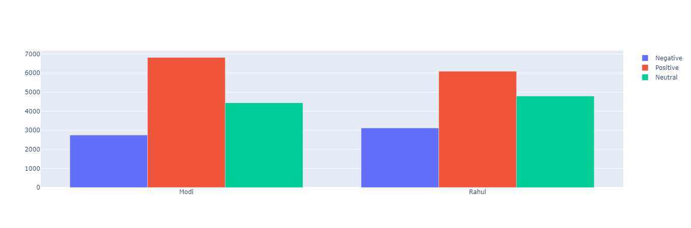

# Twitter Sentiment Analysis

In this repository you can find data related to the 2019 Indian General Election data, and a simple RNN model is trained using the tensorflow framework in python to predict the Sentiment of tweets and analyse the user trend about Narendra Modi and Rahul Gandhi election performance in Loksabha 2019.

## Bar Chart 

